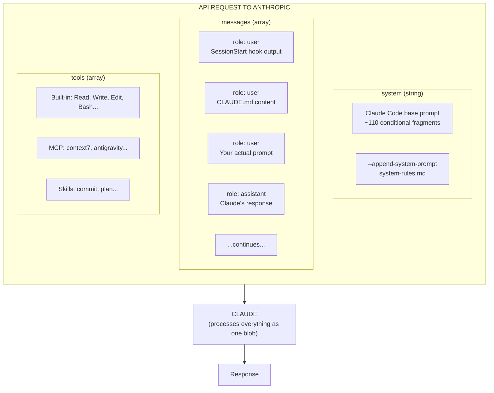
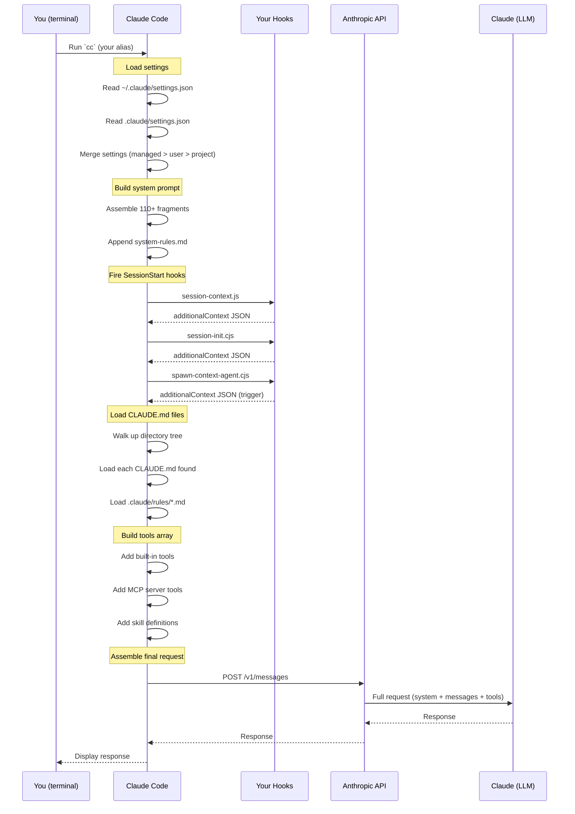
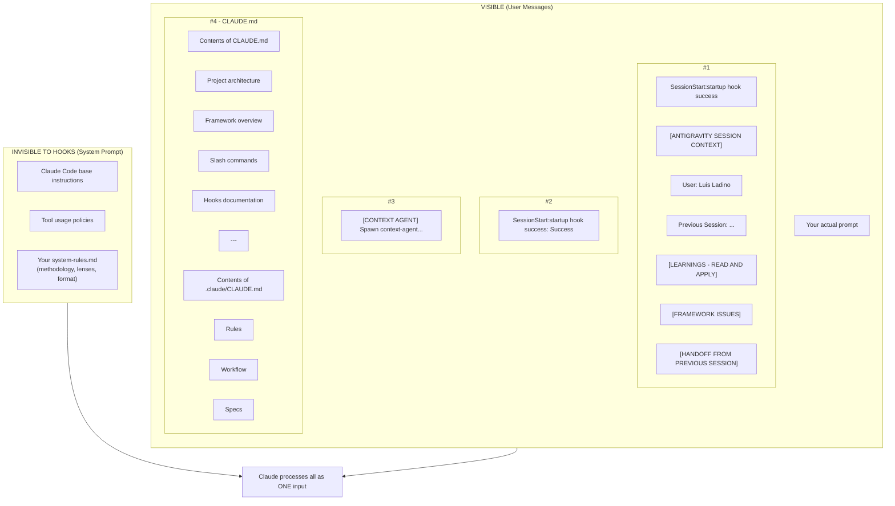
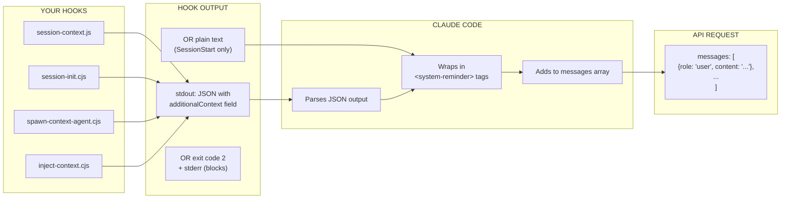
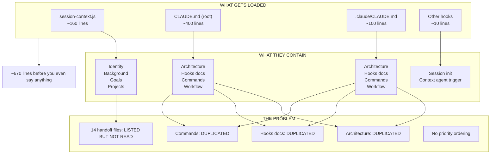
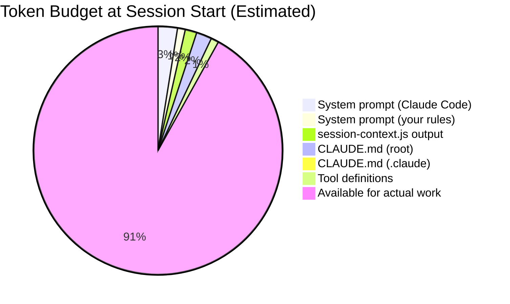
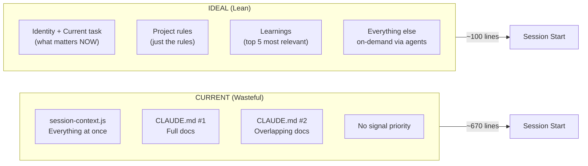

# How Claude Receives Data

**Purpose:** Explain the fundamental architecture of how data flows from your system to Claude's context window. This is the ground truth for understanding and improving the framework.

**Last updated:** 2026-03-16
**Sources:** Anthropic API docs, Claude Code docs, agent research

---

## The Simple Truth

Claude is stateless. Every single request is a fresh start.

```
┌──────────────────────────────────────────────────────────────┐
│                    EACH API REQUEST                          │
├──────────────────────────────────────────────────────────────┤
│  You send:                                                   │
│  {                                                           │
│    "system": "instructions for Claude",                      │
│    "messages": [ full conversation history ],                │
│    "tools": [ all tool definitions ]                         │
│  }                                                           │
│                                                              │
│  Claude returns:                                             │
│  {                                                           │
│    "content": "response"                                     │
│  }                                                           │
│                                                              │
│  Then Claude forgets everything.                             │
│  Next request must send everything again.                    │
└──────────────────────────────────────────────────────────────┘
```

Claude Code handles this for you - it maintains the conversation and sends the full history each time.

---

## The Three Parts of Every Request

### Part 1: System Prompt

The `system` field. Instructions that shape Claude's behavior.

**What goes here:**
- Anthropic's built-in Claude Code instructions (~110 conditional fragments)
- Your `--append-system-prompt` content (system-rules.md)
- Tool policies and behavioral rules

**Key fact:** This is the ONLY part that has "authority" over Claude's behavior. Everything else is just context Claude reads.

### Part 2: Messages Array

The `messages` field. The conversation history.

**Structure:**
```json
{
  "messages": [
    {"role": "user", "content": "hook output + CLAUDE.md content"},
    {"role": "assistant", "content": "Claude's response"},
    {"role": "user", "content": "your next prompt"},
    ...
  ]
}
```

**Critical insight:** CLAUDE.md files are injected as USER MESSAGES, not system prompt. They're context Claude reads, not enforced configuration.

### Part 3: Tools Array

The `tools` field. Definitions of what Claude can do.

**Includes:**
- Built-in tools (Read, Write, Edit, Bash, Glob, Grep, etc.)
- MCP server tools (context7, antigravity, etc.)
- Skill definitions

---

## Mermaid Diagrams

### Diagram 1: API Request Structure



### Diagram 2: Session Start Sequence



### Diagram 3: What Claude Actually Sees



### Diagram 4: Hook Output Injection



### Diagram 5: Your Current Session Start (The Problem)



### Diagram 6: Context Window Budget



### Diagram 7: Ideal vs Current Architecture



---

## The Order of Operations

### At Session Start

| Order | What Happens | Source | Output |
|-------|--------------|--------|--------|
| 1 | Load managed settings | MDM/registry | Config |
| 2 | Load user settings | ~/.claude/settings.json | Config |
| 3 | Load project settings | .claude/settings.json | Config |
| 4 | Build system prompt | 110+ fragments + system-rules.md | System field |
| 5 | Fire SessionStart hooks | Your hooks run in parallel | additionalContext |
| 6 | Load CLAUDE.md files | Walk up directory tree | User messages |
| 7 | Load rules | .claude/rules/*.md | User messages |
| 8 | Build tools array | Built-in + MCP + skills | Tools field |
| 9 | Assemble request | Combine all above | API request |
| 10 | Send to API | POST /v1/messages | Response |

### On Each User Prompt

| Order | What Happens | Source | Output |
|-------|--------------|--------|--------|
| 1 | Fire UserPromptSubmit hooks | Your hooks | additionalContext |
| 2 | Add to conversation history | Your prompt | Messages array |
| 3 | Send full conversation | System + all messages + tools | API request |
| 4 | Receive response | Claude's output | Display to you |
| 5 | Fire PostToolUse hooks | If tools were used | Tracking/injection |

---

## Key Insights

### 1. CLAUDE.md Has Less Authority Than You Think

It's loaded as a user message, not system prompt. Claude reads it as context, not as enforced rules. If you want something enforced, it needs to be in:
- The system prompt (system-rules.md)
- A hook that blocks actions (exit code 2)

### 2. Everything Is Text

There's no magic injection mechanism. Hooks output text, Claude Code wraps it in tags, it becomes part of the messages array. Claude sees one big text input.

### 3. Hooks Run in Parallel

Multiple hooks for the same event run simultaneously, not sequentially. They all get the same input and their outputs are combined.

### 4. The API Is Stateless

Every request sends the FULL conversation. Claude Code manages this, but it means your context grows with each turn until compaction happens.

### 5. Compaction Is Lossy

When context gets too big (~75%), Claude Code summarizes older parts. Details can be lost. Important things should be in files that can be re-read, not just conversation history.

---

## Files That Matter

| File | What It Does | When Loaded |
|------|--------------|-------------|
| `~/.claude/settings.json` | Hook configuration | Session start |
| `~/.claude/system-rules.md` | Your methodology/rules | Session start (system prompt) |
| `~/.gemini/antigravity/scripts/session-context.js` | Identity, learnings, handoff | Session start (hook) |
| `CLAUDE.md` | Project context | Session start (user message) |
| `.claude/CLAUDE.md` | Project rules | Session start (user message) |
| `~/.gemini/antigravity/brain/learnings.md` | Persistent learnings | Read by session-context.js |
| `~/.gemini/antigravity/brain/{uuid}/handoff.md` | Previous session context | Read by session-context.js |

---

## Recommendations

### Immediate Fixes (Issue #28)

1. **Deduplicate CLAUDE.md** - Don't have two files with overlapping content
2. **Summarize handoffs** - Show count + most recent, not all 14 paths
3. **Priority order** - Most important info first (current task, blockers)
4. **Token budget** - Target max 2000 tokens for session context

### Architecture Improvements

1. **Move docs to on-demand** - Don't load hooks documentation at session start. Load when editing hooks.
2. **Lean CLAUDE.md** - Just rules. No documentation.
3. **Use agents** - Context Agent can fetch detailed context when needed, not upfront
4. **Rules directory** - Use .claude/rules/*.md with file pattern scoping to load only relevant rules

---

*This document is the ground truth. Update it when architecture changes.*
