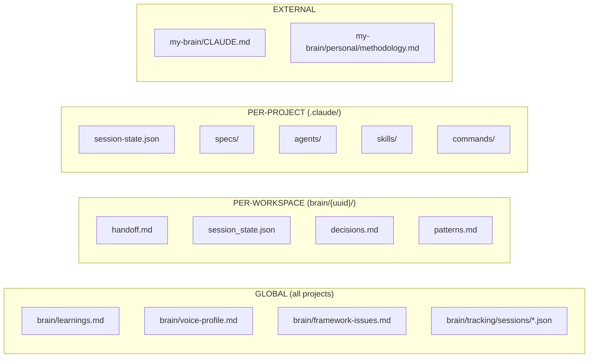
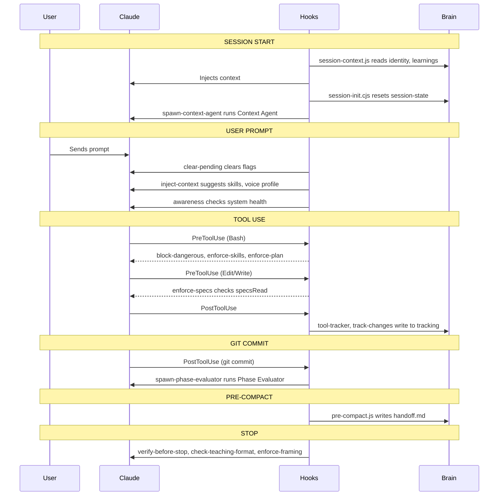

# System Architecture Diagram

**When to read this:** Before modifying hooks, scripts, or data flow.
**When to update:** After adding/removing hooks, changing what files are read/written, or modifying lifecycle.

---

## Session Lifecycle

```mermaid
flowchart TD
    subgraph SessionStart["SESSION START"]
        SC[session-context.js] --> |reads| MB[my-brain/CLAUDE.md]
        SC --> |reads| LS[brain/learnings.md]
        SC --> |reads| FI[brain/framework-issues.md]
        SC --> |reads| SS[brain/{uuid}/session_state.json]
        SC --> |reads & archives| HO[brain/{uuid}/handoff.md]

        SI[session-init.cjs] --> |writes| LSS[.claude/session-state.json]
        SI --> |reads| SYNC[.claude/specs/.sync-state.json]

        SCA[spawn-context-agent.cjs] --> |outputs| TRIGGER[Trigger instruction]
        Note over SCA: Claude then spawns context-agent via Task tool
    end

    subgraph CompactOnly["AFTER COMPACT ONLY"]
        PCR[post-compact-recovery.js] --> |reads| METH[my-brain/personal/methodology.md]
        PCR --> |reads| LS2[brain/learnings.md]
        PCR --> |reads| HO2[brain/{uuid}/handoff.md]
        PCR --> |reads| DEC[brain/{uuid}/decisions.md]
        PCR --> |reads| PAT[brain/{uuid}/patterns.md]
    end

    SessionStart --> DuringSession
    CompactOnly --> DuringSession

    subgraph DuringSession["DURING SESSION"]
        UPS[UserPromptSubmit] --> CP[clear-pending.cjs]
        UPS --> IC[inject-context.cjs]
        UPS --> AW[awareness.cjs]

        CP --> |clears flags| LSS
        IC --> |reads| VP[brain/voice-profile.md]
        IC --> |suggests| SKILLS[Skills/Commands]

        PTU_BASH[PreToolUse Bash] --> BD[block-dangerous.cjs]
        PTU_BASH --> ES[enforce-skills.cjs]
        PTU_BASH --> EP[enforce-plan.cjs]

        PTU_EDIT[PreToolUse Edit/Write] --> ESP[enforce-specs.cjs]
        ESP --> |checks| LSS

        POST[PostToolUse] --> TT[tool-tracker.cjs]
        POST --> TC[track-changes.cjs]
        POST --> TSR[track-spec-reads.cjs]
        POST --> CL[command-log.cjs]
        POST --> DP[detect-pivot.cjs]

        TT --> |writes| TRACK[brain/tracking/sessions/{id}.json]
        TC --> |writes| TRACK
        CL --> |writes| TRACK

        COMMIT[git commit] --> SPE[spawn-phase-evaluator.cjs]
        SPE --> |reads| PE[.claude/agents/phase-evaluator.md]
    end

    DuringSession --> PreCompact

    subgraph PreCompact["PRE-COMPACT"]
        PC[pre-compact.js] --> |reads| TRACK
        PC --> |writes| HO
        PC --> |writes| SS
    end

    subgraph Stop["STOP HOOKS"]
        VBS[verify-before-stop.cjs] --> |checks| FILES[Modified files]
        CTF[check-teaching-format.cjs] --> |reads| TRANSCRIPT[Transcript]
        EF[enforce-framing.cjs] --> |reads| TRANSCRIPT
    end
```

---

## Data Stores



---

## Hook Trigger Points



---

## Update Triggers

This diagram needs updating when:

| Change | What to Update |
|--------|----------------|
| Add/remove hook in settings.json | Session Lifecycle diagram |
| Hook reads new file | Add arrow to Data Stores |
| Hook writes new file | Add arrow to Data Stores |
| New agent file added | Add to Session Lifecycle |
| New skill/command added | Not in diagram (too granular) |
| Change lifecycle timing | Hook Trigger Points sequence |
