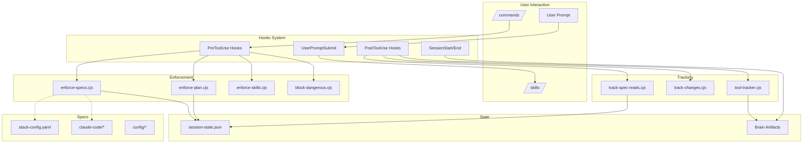
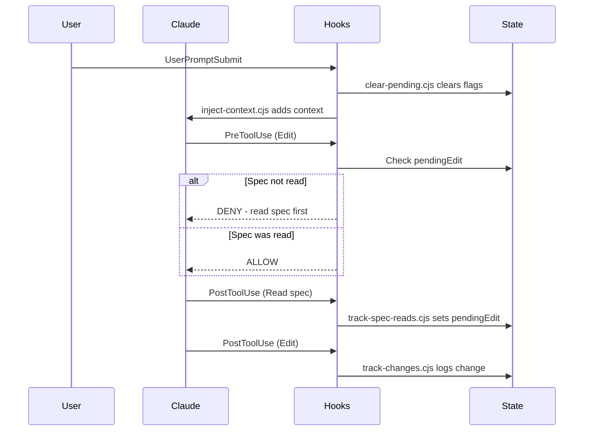

# Framework Wiring

How the claude-dev-framework components connect and interact.

---

## Overview Diagram



---

## Hook Event Flow



---

## State Management

| File | Purpose | Updated By |
|------|---------|------------|
| `.claude/session-state.json` | Per-prompt flags (pendingEdit, pendingIssue) | enforce-specs, track-spec-reads, clear-pending |
| `brain/{uuid}/session_state.json` | Cross-session state | pre-compact.js |
| `brain/learnings.md` | Persistent learnings | pre-compact.js |

---

## Enforcement Chain

```
Edit/Write Tool Call
       │
       ▼
enforce-specs.cjs
       │
       ├─ Check file type → Determine required spec
       │
       ├─ Check session-state.json → Is pendingEdit set for this type?
       │
       └─ Exit 0 (allow) or Exit 2 (deny)
```

---

## Spec Loading

```
/start-task invoked
       │
       ▼
Read stack-config.yaml
       │
       ├─ specs.claude-code → tools, hooks, skills, agents, anti-patterns
       │
       └─ specs.config → version-control
       │
       ▼
track-spec-reads.cjs sets pendingEdit
       │
       ▼
Edits allowed for this prompt
```

---

## Key Connections

| Component | Depends On | Used By |
|-----------|------------|---------|
| enforce-specs.cjs | session-state.json | PreToolUse (Edit\|Write) |
| track-spec-reads.cjs | FILE_TO_SPEC mapping | PostToolUse (Read) |
| clear-pending.cjs | session-state.json | UserPromptSubmit |
| session-init.cjs | session-utils.cjs | SessionStart |
| tool-tracker.cjs | brain/tracking/sessions/ | PostToolUse (*) |
